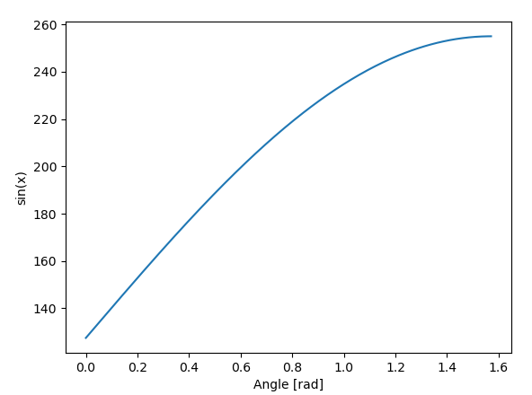
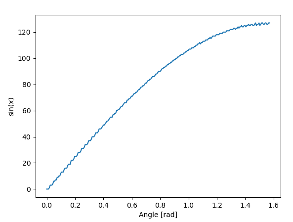

# SIN WAVE COMPRESION FOR FPGA IMPLEMENTATION USING HUFFMAN CODING AND SVD

This project implement a DDS **digital direct synthesis** in a CYCLONE V FPGA with Quartus enviorment.
The advantage of this project is that it reduces memory footprint in RAM usage.

This project uses a SVD and huffman compression without reduce as little as possible resolution. The generation of sin wave is avalibable in the PythonScript folder, and values are avaiblable in ouput.txt or Compressed_sin.txt. This files are free to use for any project. However this could be not enought and we try to reduce memory footprint due to RAM memory is quite expensive for FPGA projects or embeded systems.

# How to DDS

DDS is a  way to generate sine wave in embbeded systems. The main idea is to save in memory only one fourth of the signal and replicate it 3 times with some transformations. 

1. Read memory Forward 
2. Read memory Backward 
3. Read memory Forward negative polarization 
4. Read memory Backward negative polarization

# Article in spanish
Available ariticle in spanish for more details an hardware architecture. 

# Results 
In this project it is proposed to use SVD and huffan coding to reduce memory foot print on sin wave generation. 

**Normal memory footprint for DDS**

255 X 7 bits  = 1785 spaces

**SVD and huffman**

109 X (7 bits+4 bits for huffman) = 1199 spaces

**Compress rate**

32.82%

### USUALLY SIN WAVE

{ width=30%,height:30px}

### SVD SIN WAVE

{ width=30%,height:30px}
